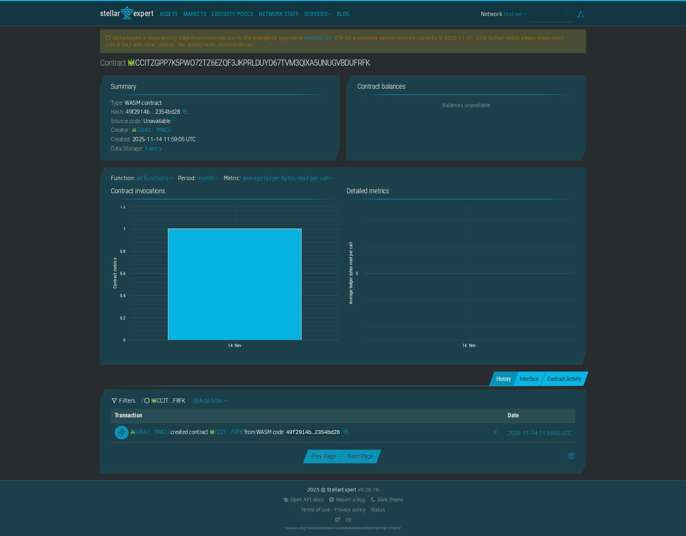

# Reminder App

## Project Description
The Reminder App contract enables users to create and store reminders on the Stellar blockchain. It allows users to set reminders with unique IDs and messages that can be retrieved when needed. This provides a permanent record of reminders that cannot be lost or accidentally deleted. The contract uses minimal storage to keep costs affordable for regular use.

This contract is perfect for individuals, teams, or organizations that need to maintain important reminders and never want to lose them. Unlike traditional reminder apps that store data on centralized servers, this blockchain-based solution ensures that your reminders are stored permanently and can be accessed from anywhere. The contract is ideal for personal productivity, team coordination, deadline tracking, or any scenario where you need reliable reminder storage that cannot be lost.

**Key Benefits:**
- **Permanent Storage**: Reminders are stored permanently on the blockchain
- **No Data Loss**: Reminders cannot be lost or accidentally deleted
- **Global Access**: Access reminders from any device or location
- **Decentralized**: No dependency on a central server or service
- **Cost-Effective**: Affordable storage for regular reminder use
- **Verifiable**: All reminders are cryptographically verifiable



**Contract Address:** `CCITZGPP7K5PWO72TZ6EZQF3JKPRLDUYD67TVM3QIXA5UNUGVBDUFRFK`

**View on Stellar Expert:** [https://stellar.expert/explorer/testnet/contract/CCITZGPP7K5PWO72TZ6EZQF3JKPRLDUYD67TVM3QIXA5UNUGVBDUFRFK](https://stellar.expert/explorer/testnet/contract/CCITZGPP7K5PWO72TZ6EZQF3JKPRLDUYD67TVM3QIXA5UNUGVBDUFRFK)

## Features
- Simple getter function to retrieve reminders
- Simple setter function to set reminders
- Basic storage model using reminder ID to message mapping
- Minimal, gas-efficient logic

## Building the Contract

To build use:
```bash
stellar contract build
```

## Deploy to Testnet
Run:

```bash
stellar contract deploy \
  --wasm target/wasm32v1-none/release/project-31.wasm \
  --source-account alice \
  --network testnet \
  --alias project-31
```


